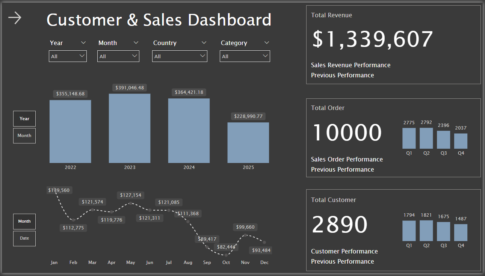
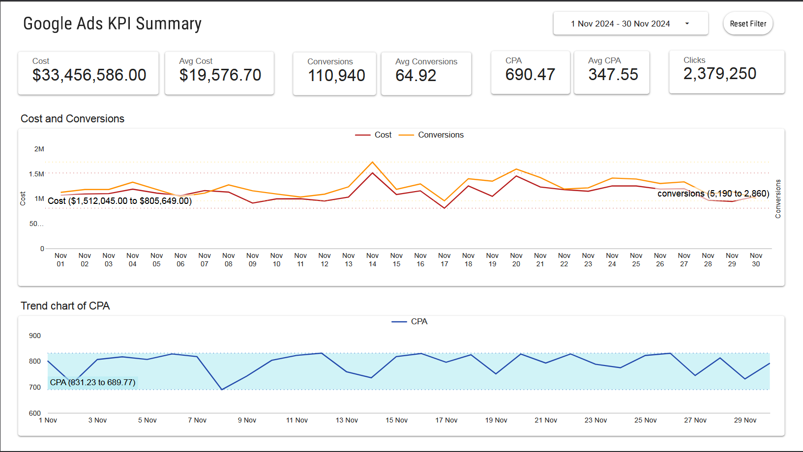
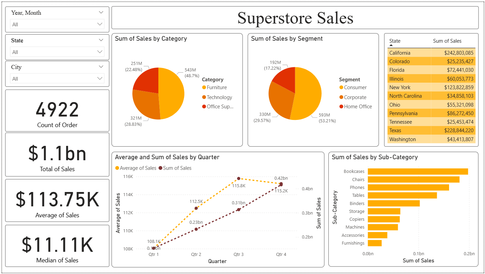

# Dashboard

## 📖 Project Overview
An end-to-end data analysis project to uncover insights into sales performance, customer behavior, and operational efficiency for a multi-year e-commerce dataset. The goal was to identify key drivers of profitability and provide actionable recommendations.

## 🎯 Business Objectives
- Identify top-performing products and categories by revenue and profit margin.
- Analyze customer segments to understand lifetime value and purchasing behavior.
- Monitor key operational metrics like return rates and shipping times.

## 🛠️ Tools & Technologies
- **Data Visualization:** Google Looker Studio
- **Data Processing & ETL:** SQL, Google BigQuery
- **Data Wrangling:** Microsoft Excel (Power Query)

## Dashboard-dashboard
### Customer & Sales Dashboard

This dashboard provides a performance overview of sales and customers between 2022 and 2025. It reports a total revenue of $1,339,607 and 10,000 total orders. The analysis tracks performance by year, showing the highest revenue in 2023 , and also breaks down orders by quarter. Monthly revenue trends are visualized to identify seasonal patterns. The report highlights the top 10 customers and top 10 products by sales, identifying key contributors to revenue.

### E-Commerce Sales Analysis

This presentation provides a comprehensive sales overview of an e-commerce platform from September 2016 to August 2018. Key metrics include a total revenue of R$1.54 billion , 96,461 total orders , and 99,441 customers. The analysis shows a significant upward trend in monthly revenue over this period. Geographically, Sao Paulo is the highest-performing city in terms of both revenue and order volume. The report also delves into customer analysis, payment methods, and product category performance. The primary payment method used by customers is the credit card

### Google Ads Performance Summary (November 2024)

This report summarizes the performance of a Google Ads campaign for November 2024. The campaign incurred a total cost of $33.4 million to generate 110,940 conversions and over 2.3 million clicks , resulting in an average Cost Per Acquisition (CPA) of $690.47. Performance is broken down by device type, with traffic distributed almost evenly across Desktop (34.7%), Mobile (33.6%), and Tablet (31.6%). The analysis also identifies the top-performing keywords by cost and provides a detailed table of individual ad performance, including metrics like CTR and conversion rate.

### The Look E-Commerce Analysis

This is a detailed, multi-page analysis of "The Look" e-commerce platform. The executive overview highlights key metrics such as $29 million in revenue , $13.9 million in profit , a 48.10% profit margin , and 100,000 total users. The analysis is divided into sections:
- Product & Sales: Examines profit and revenue distribution across categories, with a total of 181,249 units sold.
- Customer Deep Dive: Explores user demographics, lifetime value, and acquisition channels, revealing that "Search" is the primary traffic source.
- Order & Fulfillment: Details the order lifecycle, showing a 10.07% return rate and breaking down order statuses (e.g., Shipped, Complete, Returned).

### Pizza Sales 2015

This dashboard presents an analysis of pizza sales for the year 2015. It summarizes key performance indicators, including a total revenue of $817,860 , 48,620 orders , and 21,350 customers. The analysis breaks down performance by pizza type, category, and size, revealing that the "Classic" category and Large ("L") size are the most popular. The Classic Deluxe Pizza is one of the most frequently ordered items. A monthly revenue trend chart shows fluctuations throughout the year, with performance peaking in July. The report also identifies top customers based on their purchasing behavior.

### Superstore Sales Analysis

This presentation analyzes the performance of a superstore, which generated total sales of $1.1 billion from 4,922 orders. The analysis breaks down sales by multiple dimensions. The "Consumer" segment accounts for the majority of sales (53.21%) , and "Furniture" is the highest-selling category (48.7%). Geographically, California ($242.8M) and Texas ($228.8M) are the top-performing states. The dashboard also identifies top customers by sales volume, with Anna Gayman leading the list. Sales trends are visualized over time by quarter and year.

