# Portofoilo 2026

## Financial Performance Dashboard — LoremIpsum Corp
Overview

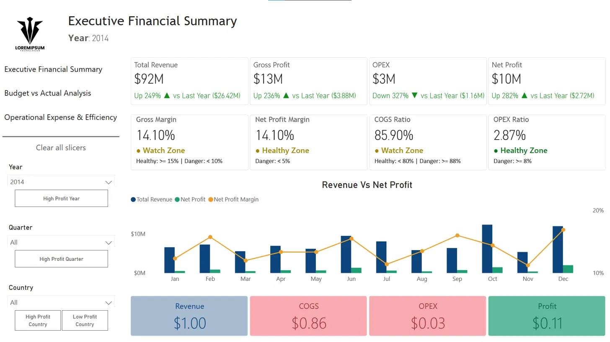
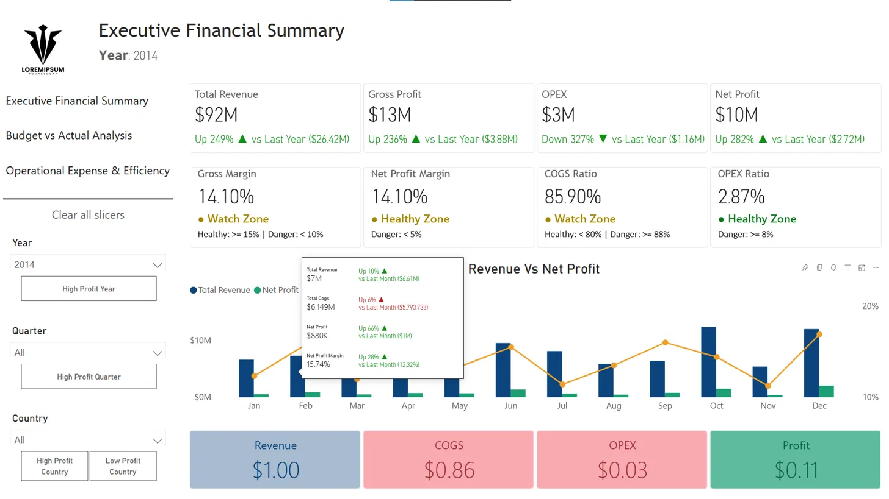
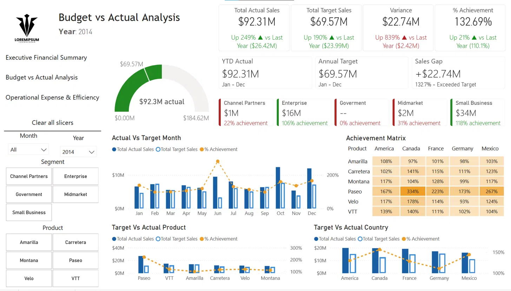
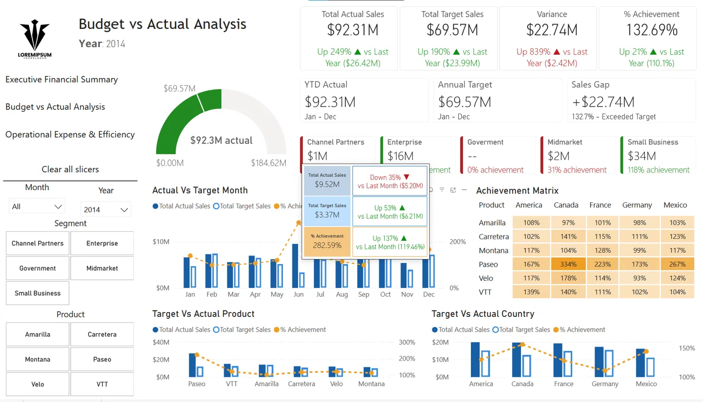
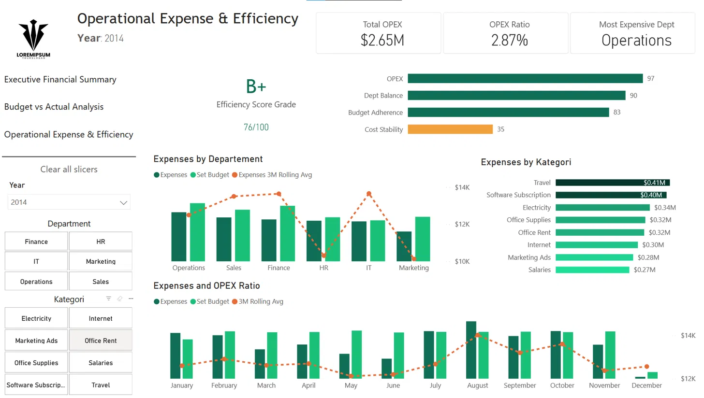
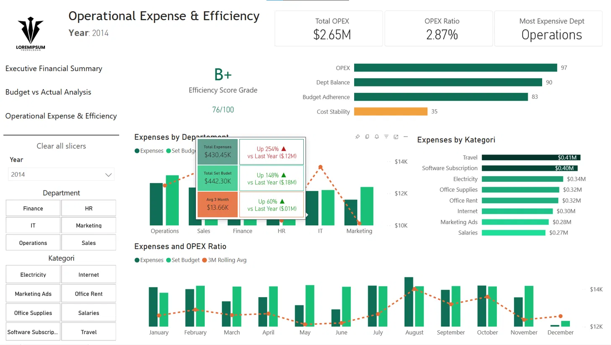

3-page Power BI financial analytics dashboard covering Executive Financial Summary, Budget vs Actual Analysis, and Operational Expense & Efficiency
Key highlight: custom rich tooltips on every chart displaying detailed metrics (MoM change, vs Last Year comparison) without cluttering the main canvas
Interactive slicers for Year, Quarter, Month, Country, Segment, Department, and Product category

Dashboard Pages

- Executive Financial Summary — KPI cards with health zone indicators (Healthy/Watch/Danger), Revenue vs Net Profit trend, and cost breakdown ratio (Revenue $1 → COGS $0.86 → OPEX $0.03 → Profit $0.11)
- Budget vs Actual Analysis — YTD gauge chart, achievement rate by segment and product, Achievement Matrix heatmap across 5 countries and 6 products, actual vs target by month/product/country
- Operational Expense & Efficiency — Efficiency Score Grade (B+ / 76/100), OPEX breakdown by department and category, 3-month rolling average trend, budget adherence scoring

Tooltip Feature

- Every visual includes custom tooltips surfacing contextual detail: current value, % change vs last month, and % change vs last year — enabling drill-down insight without page navigation

## HR Analytics Dashboard — PT. Maju Bersama Tbk.
Overview
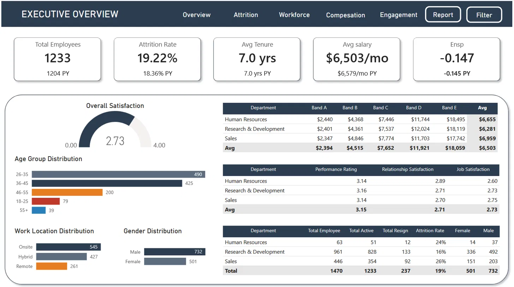
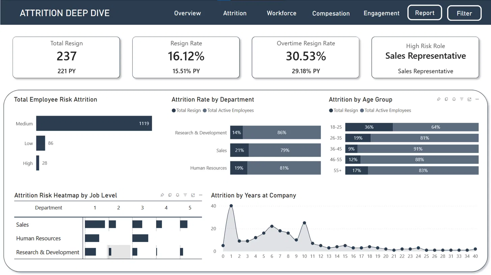
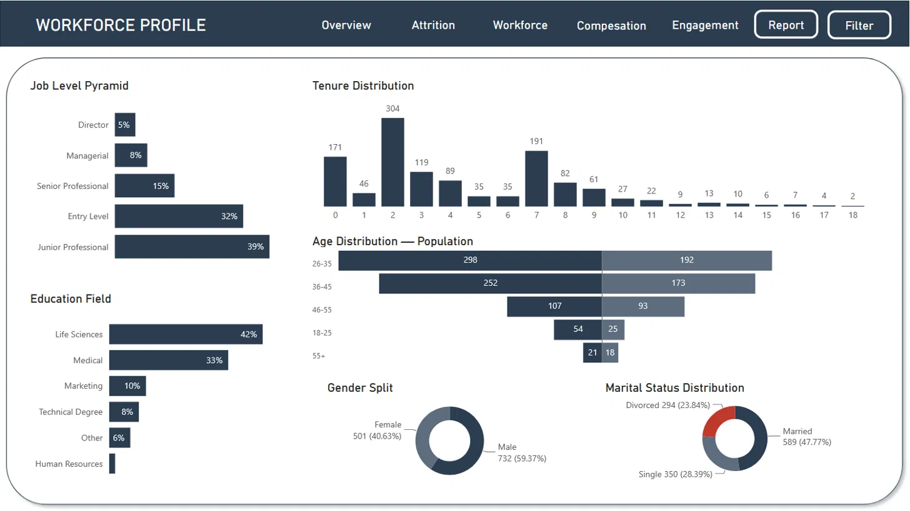
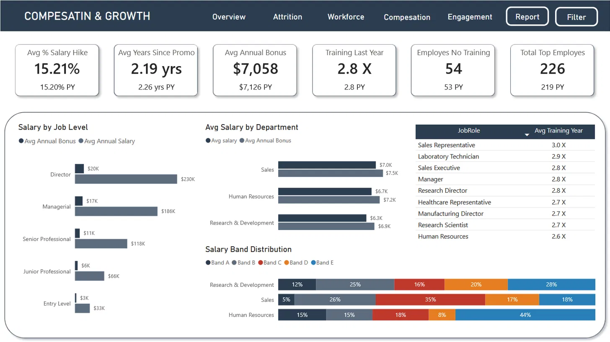
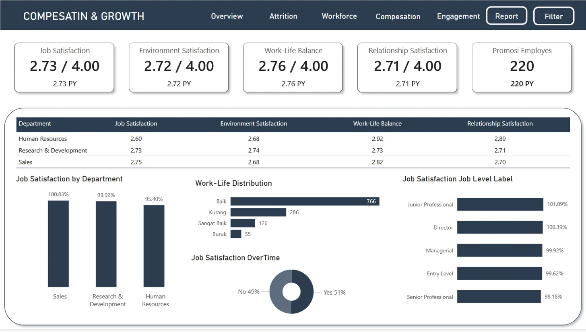

Multi-page Power BI HR analytics dashboard built from employee data of 1,470 total workforce across 3 departments
Covers 5 analytical sections: Executive Overview, Attrition Deep Dive, Workforce Profile, Compensation & Growth, and Employee Engagement

Key Features

- Interactive filter pane with Year and Month slicer for time-based analysis
- Paginated report export functionality for formal HR reporting
- Cross-page navigation menu for seamless tab switching

Dashboard Pages

- Executive Overview — KPI cards (headcount, attrition rate, avg salary, eNPS), department summary tables, satisfaction gauge, demographic distributions
- Attrition Deep Dive — Risk segmentation, attrition by department/age/tenure, heatmap by job level, resign trend over years of service
- Workforce Profile — Job level pyramid, tenure distribution, education field breakdown, gender split, marital status
- Compensation & Growth — Salary by job level and department, salary band distribution, bonus pool, training frequency by role
- Employee Engagement — Satisfaction scores (job, environment, work-life balance, relationship), department-level engagement breakdown, satisfaction trend by job level

Data Highlights

- Attrition rate: 19.22% with Sales as highest-risk department (26%)
- Overall satisfaction score: 2.73 / 4.00
- Average monthly salary: $6,503 with 15.21% annual salary hike
- High-risk attrition employees identified: 28 employees flagged for priority HR intervention

# Portofoilo 2025

## Google ADS (Google ADS)

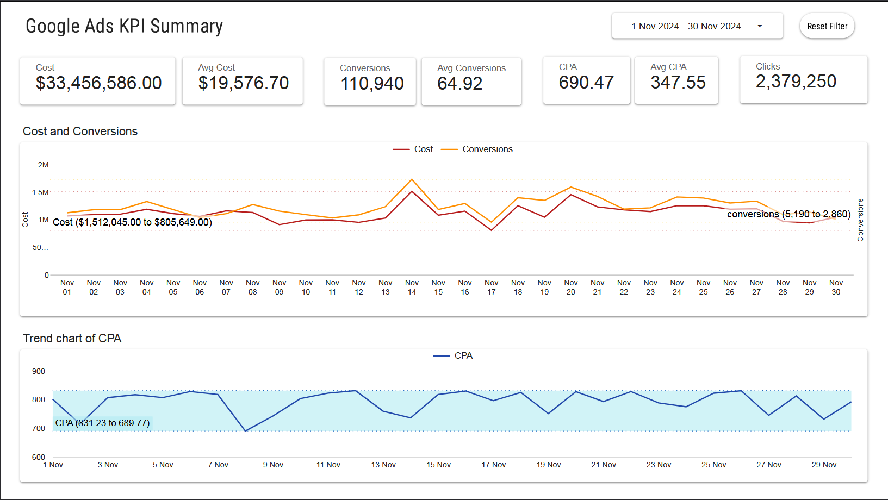
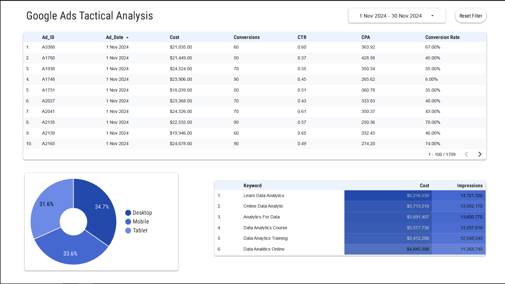

Optimasi Google Ads - November 2024 🚀

Analisis taktis kampanye menunjukkan skala performa masif dengan total biaya $33,4M. Berikut insight utamanya:

  - Efisiensi & Skala: Menghasilkan 110.940 konversi dari 2,37M klik dengan rata-rata CPA sebesar $347,55.
  - Distribusi Perangkat: Performa audiens sangat seimbang di berbagai platform: Desktop (34,7%), Mobile (33,6%), dan Tablet (31,6%).
  - Keyword Jawara: Kata kunci "Learn Data Analytics" menjadi pendorong utama dengan biaya $6,2M dan total 13,7M impresi.
  - Stabilitas Biaya: Tren CPA harian berfluktuasi secara terkendali dalam rentang $689 hingga $831.

Kesimpulan: Strategi ini berhasil menjangkau audiens luas secara merata dengan fokus investasi yang tepat pada kata kunci berperforma tinggi.

## Interactive Pizza Sales Performance & Customer Insight Dashboard (Pizza Analyst)

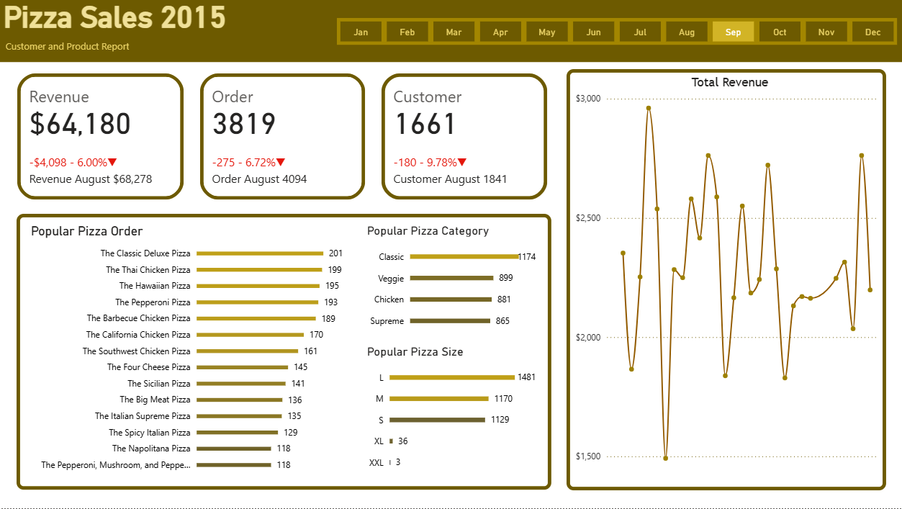
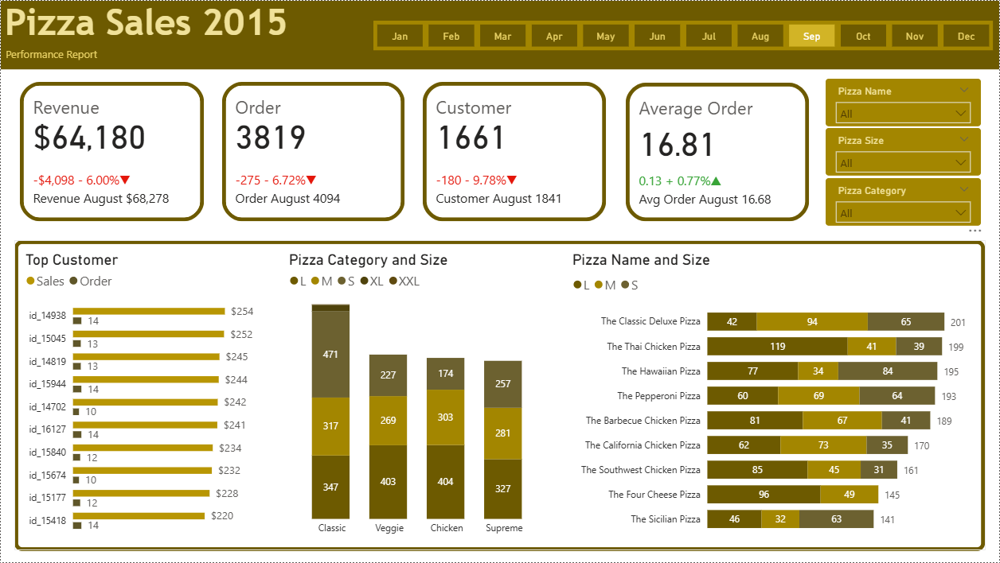

Analisis Penjualan Pizza September 2015 🍕

Performa bulan ini mencatatkan Revenue sebesar $64,180, mengalami penurunan 6% dibandingkan Agustus. Meskipun jumlah pesanan (3,819) dan pelanggan (1,661) berkurang, terdapat sinyal positif pada Average Order yang meningkat menjadi 16.81 (+0.77%).

Insight Utama:

  - Produk Unggulan: "The Classic Deluxe Pizza" menjadi favorit utama dengan 201 pesanan. Kategori Classic mendominasi pasar dengan total 1,174 pesanan.
  - Preferensi Ukuran: Konsumen sangat menyukai ukuran L (Large) yang mencatat 1,481 pesanan, menjadikannya ukuran terpopuler di semua kategori.
  - Loyalitas: Pelanggan dengan ID id_14938 memberikan kontribusi belanja tertinggi senilai $254.

Kesimpulan: Strategi upselling pada ukuran Large dan kategori Classic terbukti efektif menjaga nilai rata-rata pesanan di tengah fluktuasi jumlah pelanggan.

## Interactive Pizza Sales Performance & Customer Insight Dashboard (Look Ecommece)

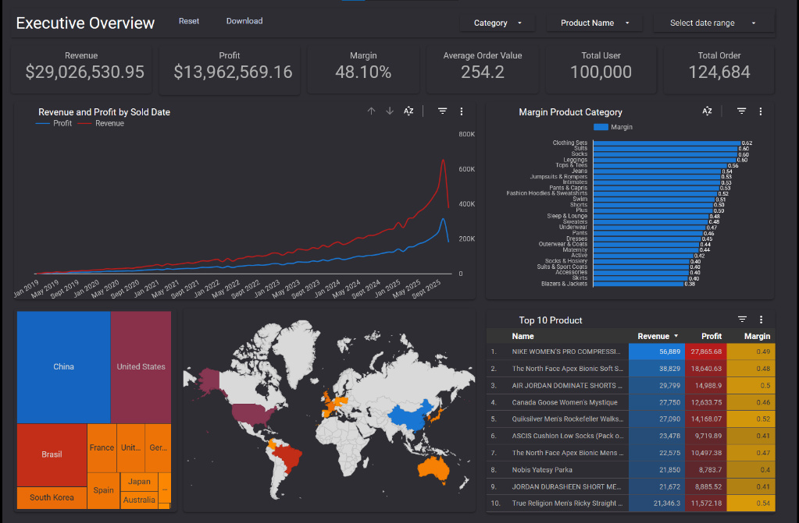
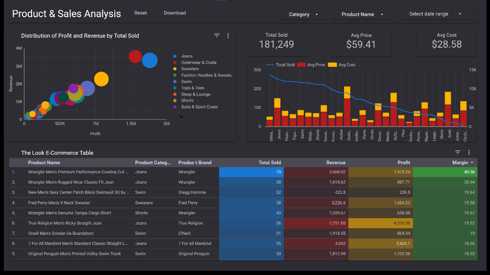
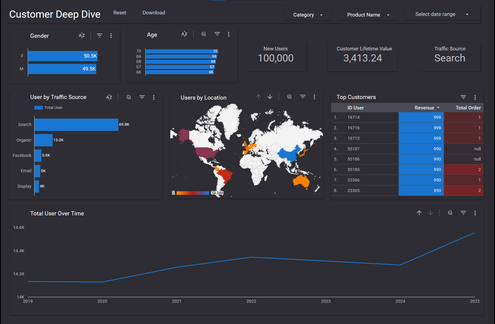
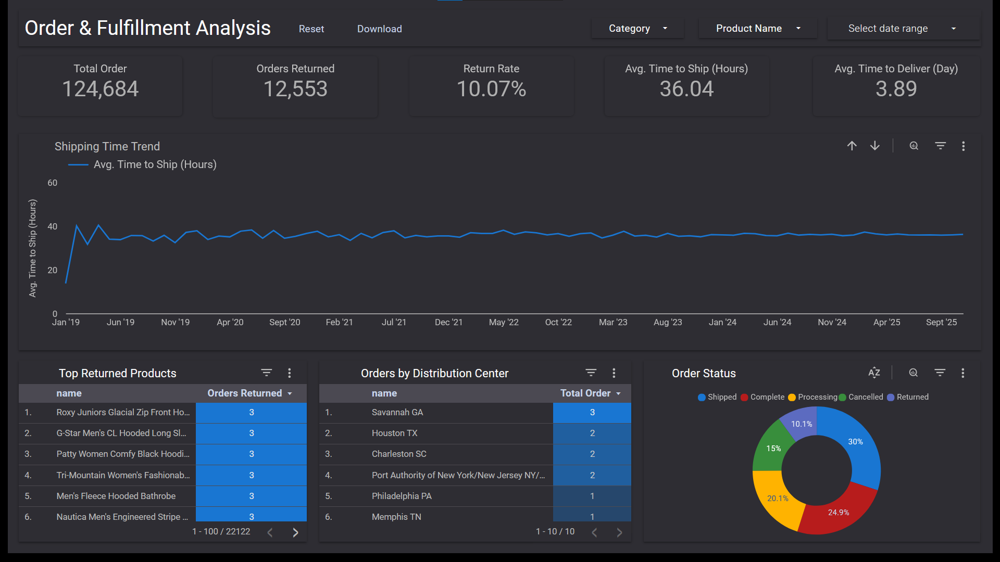

Analisis Strategis E-Commerce: The Look Dashboard 📈

Ringkasan Performa:

  - Financials: Bisnis mencatat pendapatan impresif sebesar $29,02M dengan profit $13,96M, menghasilkan margin sehat di angka 48,10%.
  - Operasional: Total pesanan mencapai 124.684 dengan tingkat pengembalian (Return Rate) sebesar 10,07%.
  - Logistik: Efisiensi pengiriman terjaga dengan rata-rata waktu kirim (Time to Ship) 36,04 jam dan waktu antar (Time to Deliver) 3,89 hari.
  - Status Pesanan: Distribusi status didominasi oleh Shipped (30%) dan Complete (24,9%), namun terdapat angka pembatalan sebesar 15%.

Insight: Meskipun margin keuntungan sangat kuat, optimasi pada pengurangan tingkat pembatalan (15%) dan pengembalian produk (10%) merupakan peluang utama untuk meningkatkan laba bersih lebih lanjut.

## Interactive Executive Business Intelligence & Sales Analytics Suite (sales E-Commmerce)

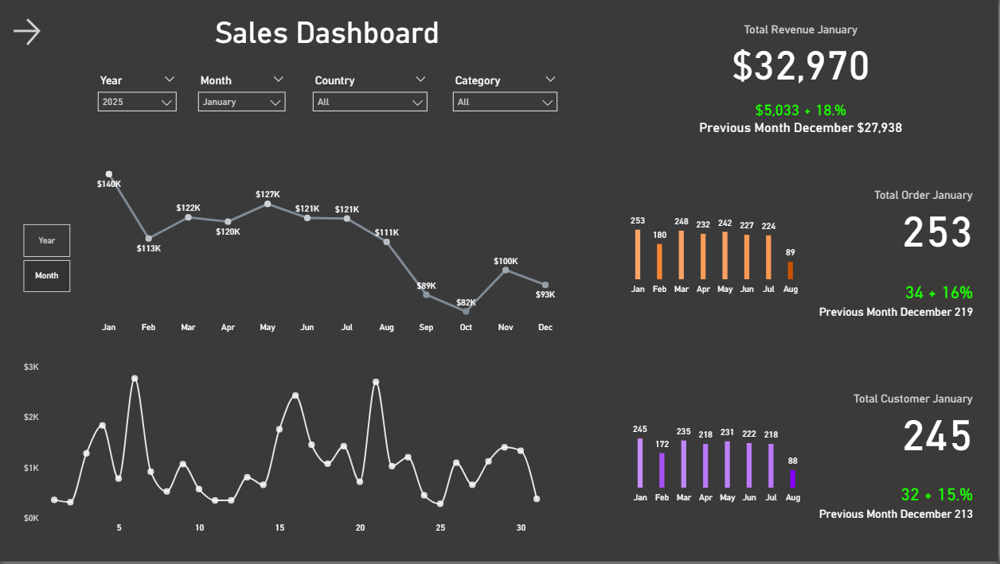
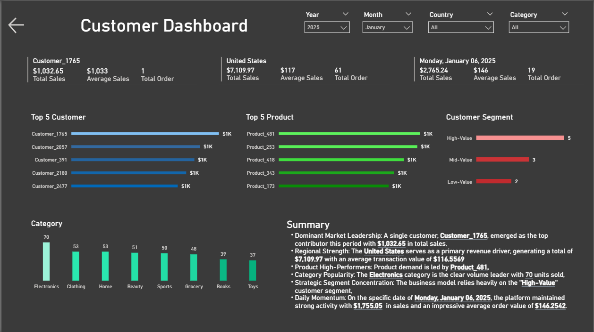

Analisis Performa Awal Tahun - Januari 2025 🚀

Dashboard menunjukkan pertumbuhan dua digit di semua metrik utama. Berikut insight dari data Januari 2025:

  - Pertumbuhan MoM: Revenue mencapai $32,970, naik 18% dibanding Desember. Kenaikan ini sejalan dengan volume pesanan (+16%) dan jumlah pelanggan (+15%).
  - Dominasi Kategori: Electronics menjadi pemimpin volume dengan 70 unit terjual.
  - Driver Utama: Amerika Serikat menjadi motor pendapatan sebesar $7,109.97. Customer_1765 menjadi kontributor tertinggi ($1,032).
  - Strategi Segmen: Bisnis sangat terkonsentrasi pada segmen High-Value (5 pelanggan). Momentum harian puncak terjadi pada 6 Januari dengan penjualan $1,755.

Kesimpulan: Awal tahun yang solid dengan efisiensi transaksi yang terjaga.

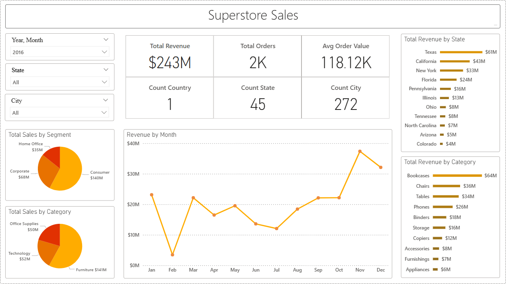
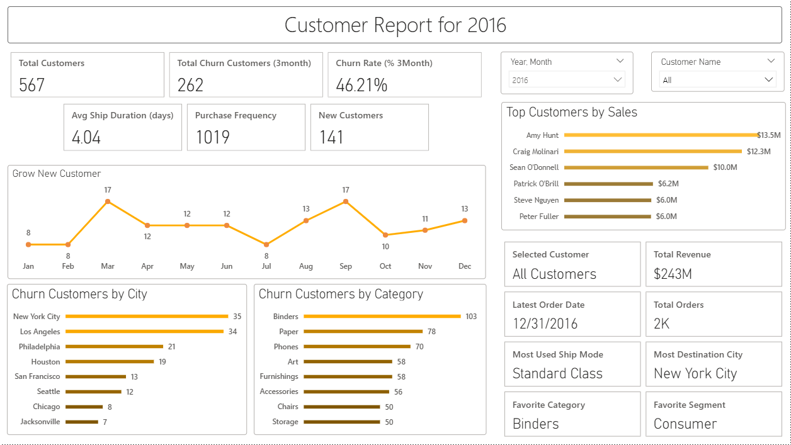

Analisis Superstore Sales 2016 📊

Insight Utama Pada Gambar:

  - Performa Finansial: Total Revenue mencapai $243M dengan rata-rata nilai pesanan $118.12K. Texas ($61M) dan segmen Consumer ($140M) menjadi penopang utama pendapatan.
  - Dominasi Produk: Kategori Furniture memimpin dengan $141M, di mana Bookcases menyumbang $64M. Binders menjadi kategori favorit sekaligus penyumbang churn tertinggi (103 pelanggan).
  - Kesehatan Pelanggan: Bisnis menghadapi tantangan retensi dengan Churn Rate 46.21%. Kehilangan pelanggan terbesar terjadi di New York City (35) dan Los Angeles (34).
  - Fokus VIP: Konsentrasi pendapatan pada pelanggan kunci sangat tinggi, seperti Amy Hunt yang berkontribusi $13.5M.

Kesimpulan: Diperlukan strategi retensi khusus di kota besar untuk menekan churn tanpa mengganggu pertumbuhan masif di sektor Furniture.

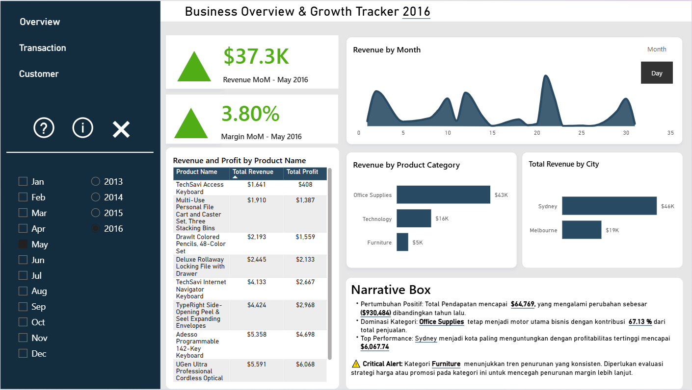
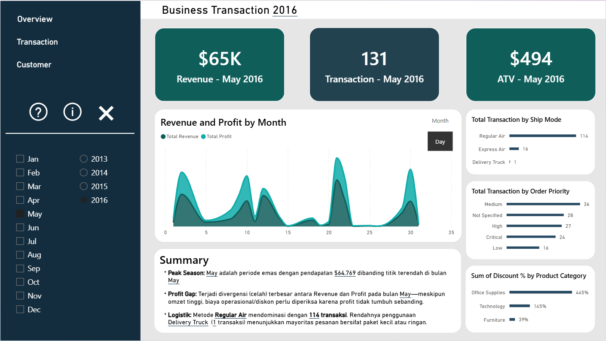
Analisis Performa Bisnis - Mei 2016 📊

Dashboard menunjukkan tren positif dengan kenaikan Revenue MoM sebesar $37.3K dan Margin tumbuh 3.80%. Berikut insight utamanya:

  - Performa: Total pendapatan mencapai $64,769 dengan Sydney sebagai kota paling menguntungkan dengan profit $6,067.74.
  - Dominasi: Office Supplies menyumbang 67.13% pendapatan, namun mencatat total diskon tinggi (445%) yang memicu "Profit Gap" atau ketidakseimbangan antara omzet dan laba.
  - Logistik: Tercatat 131 transaksi dengan ATV $494. Metode Regular Air mendominasi dengan 114 transaksi.
  - Alert: Kategori Furniture menunjukkan tren penurunan konsisten, memerlukan evaluasi strategi harga segera.

Kesimpulan: Pertumbuhan volume harus diimbangi efisiensi diskon untuk menjaga profitabilitas.

## Interactive Executive Business Intelligence & Advanced Sales Analytics Suite (Sales Report)

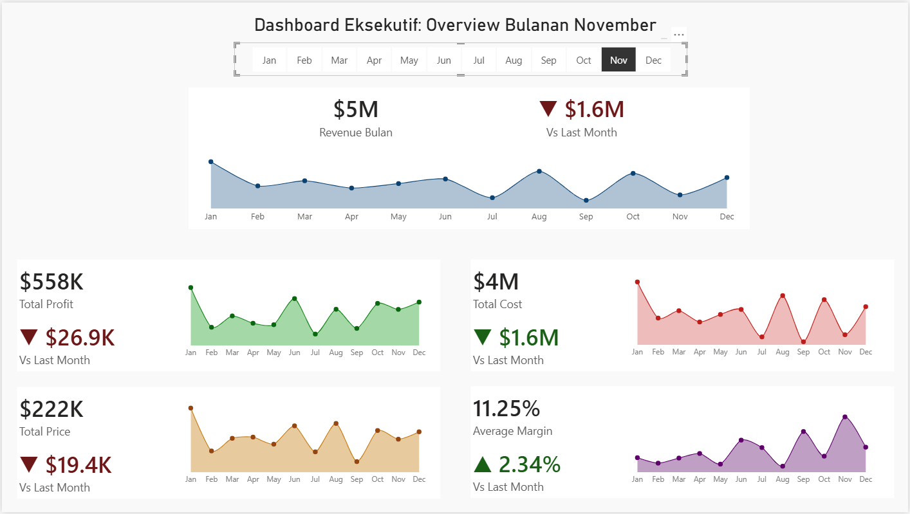
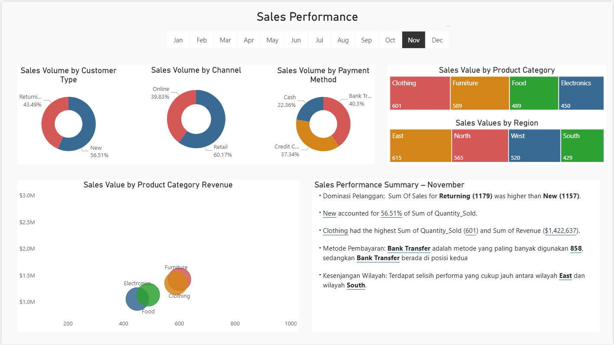

Analisis Performa Eksekutif & Penjualan - November 2016 📊

Meskipun Revenue bulan ini mencapai $5M (turun $1.6M MoM), terdapat peningkatan efisiensi operasional yang signifikan. Berikut insight utamanya:

  - Peningkatan Margin: Average Margin naik 2.34% menjadi 11.25%, menunjukkan kontrol biaya yang lebih baik meskipun volume pendapatan menurun.
  - Dominasi Produk: Kategori Clothing menjadi kontributor terbesar dengan pendapatan $1,422,637 dan volume penjualan tertinggi (601 unit).
  - Perilaku Pelanggan: Pelanggan Returning (1,179) menghasilkan nilai penjualan lebih tinggi dibandingkan pelanggan baru, mempertegas pentingnya strategi retensi.
  - Kanal & Pembayaran: Penjualan Retail mendominasi (60.17%) dengan Bank Transfer sebagai metode pembayaran terfavorit (858 transaksi).
  - Geografis: Wilayah East memimpin performa penjualan, sementara wilayah South memerlukan perhatian khusus karena selisih performa yang cukup jauh.

Kesimpulan: Fokus pada kategori profitabel dan efisiensi biaya berhasil menjaga kesehatan margin di tengah fluktuasi pasar.

## Interactive Multi-Industry BI Dashboards & Executive Analytics (Brazzilan E-Commerce)

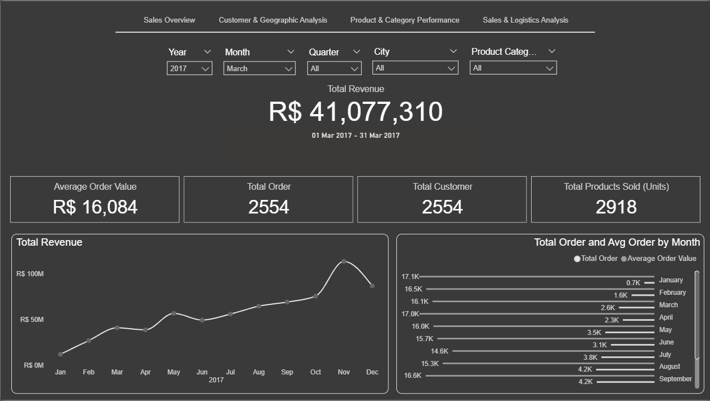
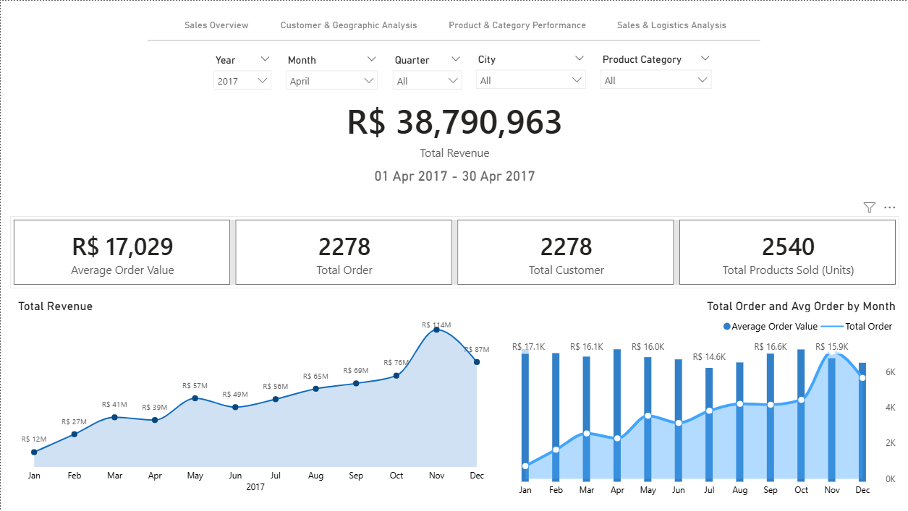

Overview: I developed a high-end Business Intelligence suite designed to transform fragmented raw data into strategic executive insights. This portfolio showcases versatility in design (Modern Dark Mode vs. Professional Light Mode) and depth in analytical modeling across Retail, E-commerce, and F&B sectors.

Key Analytical Pillars:
  - Strategic Sales & Growth: Managed datasets tracking up to $243M in revenue, featuring year-over-year growth metrics (e.g., +18.1% revenue increase) and monthly trend forecasting.
  - Customer Intelligence & Retention: Developed advanced churn analysis (identifying a 46.21% churn rate) and customer segmentation (High-Value vs. Low-Value).
  - Geographic & Logistics Analysis: Mapped sales performance across 272 cities and tracked shipping efficiency (average duration of 4.04 days).
  - Niche Industry Deep-Dives: Tailored dashboards for specific sectors like Pizza Retail, tracking 3,819 total orders and product-size correlations, as well as E-commerce ID-level tracking with review scores.

The Solution: My dashboards empower stakeholders with interactive filtering by Year, Month, Country, and Category, enabling localized decision-making and inventory optimization.

